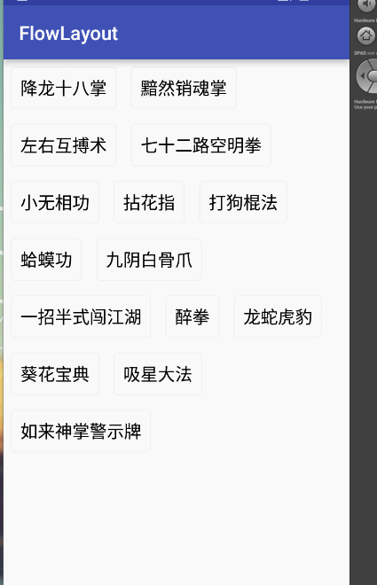

## 自定义View之流式布局FlowLayout

在我们往常的app设计中，对于一些搜索关键字的推荐，标签等，往往宽度都是不确定的，且当一行满之后会自动换行，类似下面这样，


对于该控件，无非就是我们需要获取到每一个子控件的宽，在显示的时候，当某一行的剩余宽度不足以显示下一个控件时，我们让其显示在下一行，继续提炼，主要就是一下两点。
- 在onMeasure()方法中，测量子控件，将其分类，一行显示多少控件，一行需要多大的高度。以及当前控件的大小。
- 在onLayout()中，对子控件进行布局。

那么，让我们开始吧。

首先看一下使用方式：
```java 

    @Override
    protected void onCreate(Bundle savedInstanceState) {
        super.onCreate(savedInstanceState);
        setContentView(R.layout.activity_main);
        
        setData();

        /**
         * 查找控件
         */
        mFlowLayout = ((FlowLayout) findViewById(R.id.fl));

        /**
         * 添加数据
         */
        mFlowLayout.addData(names);

        /**
         * 设置点击事件
         */
        mFlowLayout.setFlowLayoutListener(new FlowLayout.FlowLayoutListener() {
            @Override
            public void onItemClick(View view, int poition) {
                Toast.makeText(getApplicationContext(),names.get(poition),Toast.LENGTH_SHORT).show();
            }
        });

    }
```
当然，我们也可以直接在xml中进行添加子控件。

